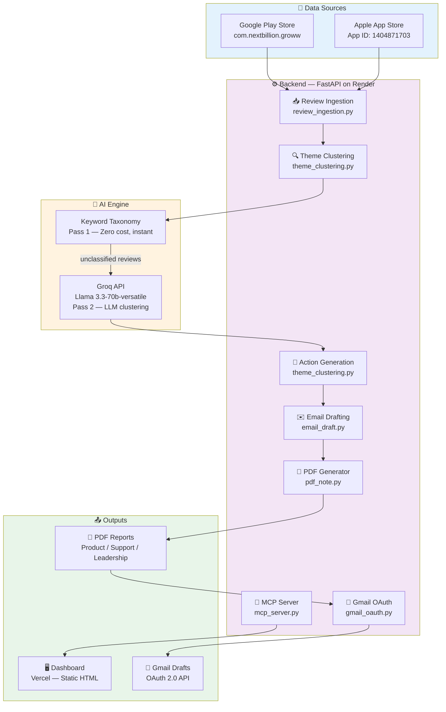
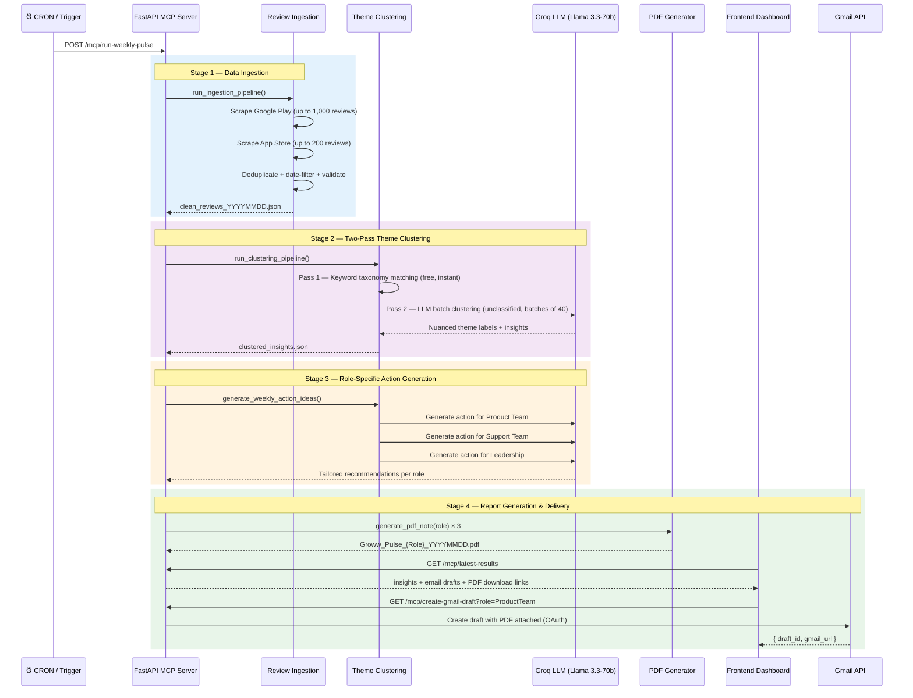
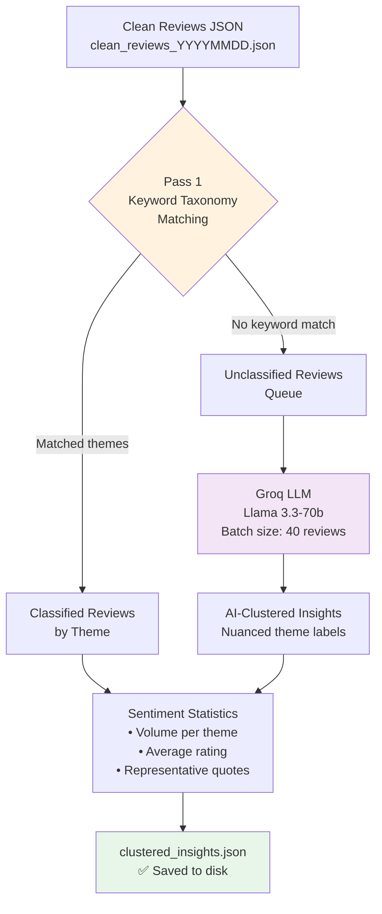
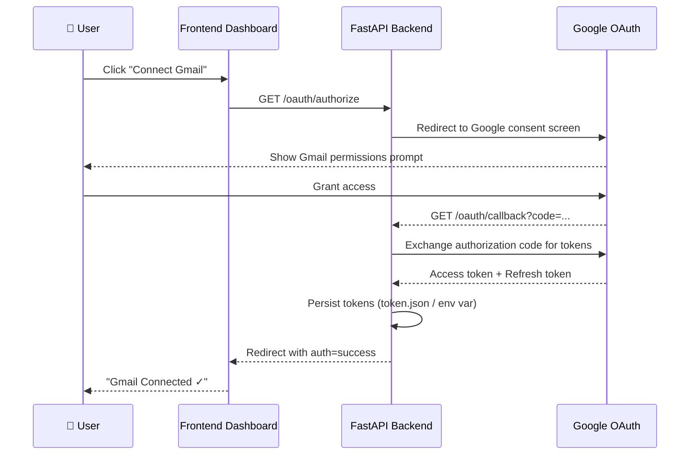

# Groww Pulse AI

[](https://fastapi.tiangolo.com)
[](https://groq.com)
[](https://vercel.com)
[](https://render.com)
[](LICENSE)

An AI-powered **weekly review intelligence engine** for fintech apps. It automatically scrapes user reviews from Google Play and the Apple App Store, clusters them into themed insights using a two-pass AI pipeline, and delivers role-specific stakeholder briefings as PDF reports via Gmail.

> Built for **Groww / Kuvera** — India's leading investment & mutual fund platform.

---

## Architecture Overview



---

## Full Pipeline Workflow



---

## Pipeline Stages

### Stage 1 — Review Ingestion

Scrapes live user reviews from both major app stores:

| Source | Library | Volume |
|--------|---------|--------|
| Google Play Store | `google-play-scraper` | up to 1,000 most recent |
| Apple App Store | `app-store-scraper` | up to 200 (rate-limited gracefully) |

Reviews are filtered by a configurable week window, deduplicated by review ID, and validated for minimum text length.

---

### Stage 2 — Two-Pass Theme Clustering



**Pass 1** — Instant, zero-cost keyword matching against a predefined theme taxonomy covering topics like Onboarding, KYC Verification, Payments, UI/UX, etc.

**Pass 2** — Remaining unclassified reviews are batched (40 at a time) and sent to Groq's `llama-3.3-70b-versatile` for deeper, nuanced theme extraction.

---

### Stage 3 — Role-Specific Action Generation

The top 3 themes by review volume are summarized and fed to the LLM, which generates one focused, highly specific recommendation for each stakeholder role:

| Role | Focus Area |
|------|-----------|
| **Product Team** | Engineering fixes, UI/UX improvements, feature priorities |
| **Support Team** | Agent preparedness, empathy scripts, immediate user relief |
| **Leadership** | Strategic impact, retention risk, high-level business priorities |

---

### Stage 4 — Report Generation & Delivery

- **PDF Reports** — Branded, role-specific briefing documents generated with `fpdf2`, named `Groww_Pulse_{Role}_YYYYMMDD.pdf`
- **Gmail Drafts** — Created with the PDF attached via Google OAuth 2.0 (no password required)
- **Frontend Dashboard** — Displays live insights, email previews, and one-click PDF downloads

---

## Project Structure

```
Groww_Pulse_AI/
├── backend/
│   ├── mcp_server.py            # FastAPI app — all API endpoints
│   ├── requirements.txt         # Python dependencies
│   ├── Procfile                 # Render deployment start command
│   ├── runtime.txt              # Python version pin for Render
│   ├── .env.example             # Environment variable template
│   ├── config/
│   │   ├── settings.py          # Env vars, file paths, constants
│   │   ├── prompts.py           # LLM prompt templates
│   │   └── theme_taxonomy.py    # Keyword taxonomy for Pass 1 clustering
│   └── tools/
│       ├── review_ingestion.py  # Play Store + App Store scraping & filtering
│       ├── theme_clustering.py  # Two-pass clustering + action idea generation
│       ├── insight_generation.py# Stakeholder insight orchestration
│       ├── email_draft.py       # Email content generation per role
│       ├── pdf_note.py          # PDF report generation (fpdf2)
│       ├── gmail_oauth.py       # Gmail OAuth 2.0 flow + draft creation
│       └── gmail_compose.py     # Gmail compose URL helpers
└── frontend/
    ├── index.html               # Single-page dashboard (Vanilla JS)
    └── vercel.json              # Vercel deployment configuration
```

---

## Tech Stack

| Layer | Technology |
|-------|-----------|
| Backend API | FastAPI + Uvicorn |
| LLM Engine | Groq API — `llama-3.3-70b-versatile` |
| Review Scraping | `google-play-scraper` + `app-store-scraper` |
| PDF Generation | `fpdf2` |
| Email | Gmail API via OAuth 2.0 (`google-auth-oauthlib`) |
| Frontend | Static HTML + Vanilla JS |
| Backend Hosting | Render.com |
| Frontend Hosting | Vercel |

---

## API Endpoints

| Method | Endpoint | Description |
|--------|----------|-------------|
| `POST` | `/mcp/run-weekly-pulse` | Trigger the full analysis pipeline |
| `GET` | `/mcp/latest-results` | Fetch latest insights, email drafts, and PDF links |
| `GET` | `/mcp/generate-pdf?role=...` | Generate PDF for a specific role |
| `GET` | `/mcp/download-note/{filename}` | Download a generated PDF report |
| `GET` | `/mcp/create-gmail-draft` | Create a Gmail draft with PDF attached |
| `GET` | `/mcp/gmail-status` | Check Gmail authentication status |
| `GET` | `/oauth/authorize` | Start Gmail OAuth 2.0 authorization flow |
| `GET` | `/oauth/callback` | OAuth redirect handler |
| `GET` | `/oauth/status` | Get current Gmail auth state + email |
| `POST` | `/oauth/logout` | Revoke Gmail OAuth tokens |
| `GET` | `/health` | Health check |

---

## Setup & Deployment

### Local Development

**1. Clone the repository**
```bash
git clone https://github.com/MayankSinghRaghav/Groww_Pulse_AI.git
cd Groww_Pulse_AI/backend
```

**2. Install dependencies**
```bash
pip install -r requirements.txt
```

**3. Configure environment variables**
```bash
cp .env.example .env
# Edit .env and fill in your keys
```

| Variable | Description | Required |
|----------|-------------|----------|
| `GROQ_API_KEY` | Get free at [console.groq.com](https://console.groq.com) | Yes |
| `GOOGLE_CLIENT_ID` | Google Cloud OAuth 2.0 Client ID | For Gmail |
| `GOOGLE_CLIENT_SECRET` | Google Cloud OAuth 2.0 Client Secret | For Gmail |
| `GOOGLE_REDIRECT_URI` | OAuth callback URL | For Gmail |
| `APP_NAME` | Target app name (e.g. `Groww`, `Kuvera`) | Yes |
| `MODEL_NAME` | LLM model ID (default: `llama-3.3-70b-versatile`) | Yes |

**4. Run the backend**
```bash
uvicorn mcp_server:app --host 0.0.0.0 --port 8000 --reload
```

**5. Open the frontend**

Open `frontend/index.html` in your browser or serve it locally.

---

### Production Deployment

#### Backend — Render.com

1. Sign in at [render.com](https://render.com) → **New Web Service**
2. Connect your repository, set **Root Directory** to `backend`
3. **Build Command:** `pip install -r requirements.txt`
4. **Start Command:** `uvicorn mcp_server:app --host 0.0.0.0 --port $PORT`
5. Add all environment variables in the Render dashboard

#### Frontend — Vercel

1. Sign in at [vercel.com](https://vercel.com) → **New Project**
2. Connect your repository, set **Root Directory** to `frontend`
3. Vercel auto-detects `vercel.json` and deploys the static dashboard

---

## Gmail OAuth Setup



1. Go to [console.cloud.google.com](https://console.cloud.google.com) and create a project
2. Enable the **Gmail API**
3. Create **OAuth 2.0 Credentials** (Web Application type)
4. Add your backend callback URL as an authorized redirect URI
5. Export `GOOGLE_CLIENT_ID` and `GOOGLE_CLIENT_SECRET` to your `.env`
6. Visit `/oauth/authorize` in your browser to authenticate

---

## License

This project is open-source under the **MIT License**.
