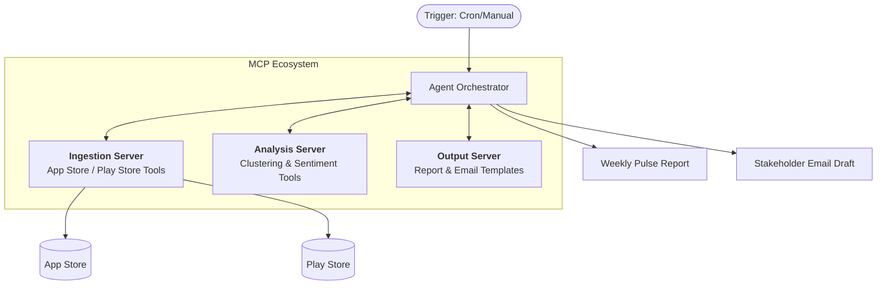

# Architecture: Weekly Review Pulse (MCP-Powered)

This document outlines a phased architectural approach for the **Kuvera Weekly Review Pulse Agent**, built on the **Model Context Protocol (MCP)**.

---

## High-Level Architecture Diagram

---

## Detailed Phase-Wise Implementation Plan

### Phase 1: Project Setup & MCP Architecture (Development)
**Goal**: Establish the base configuration and FastAPI framework.
- **MCP Server Construction**: Set up `mcp_server.py` as the primary orchestration layer.
- **Environment & Keys**: Manage `.env` securely for Claude API (`ANTHROPIC_API_KEY`).
- **Data Structure**: Scaffold `tools/`, `config/`, and `data/` directories.

### Phase 2: Review Ingestion (`fetch-reviews`)
**Goal**: Assemble clean, deduplicated feedback sets spanning the last 8 weeks.
- **Tool Implementation**: `tools/review_ingestion.py`
- **Data Sources**: Apple App Store, Google Play Store, or fallback CSV (fetch up to 1000 reviews).
- **Processing**: Normalize schemas and filter spam/bot reviews to yield ~750 high-quality reviews.

### Phase 3: Theme Clustering & Validation (`cluster-reviews`)
**Goal**: Discover high-impact topics and user sentiment using AI at $0.00 cost.
- **Tool Implementation**: `tools/theme_clustering.py`
- **Hard Keyword Pre-Clustering**: First pass uses local Python Keyword matching to categorize obvious reviews without making any API calls, bypassing the LLM completely.
- **LLM Batch Processing**: Remaining unclassified reviews are grouped into batches of 30-50 and sent to Llama 3 (via Groq/Local) in a single unified prompt to extract final themes and representative quotes while absolutely minimizing network calls.

### Phase 4: Weekly Report Generation (`generate-report`)
**Goal**: Produce the main physical deliverables for weekly review.
- **Tool Implementation**: `tools/insight_generation.py`
- **Outputs Built**: Markdown report (`.md`), PDF (rendered using `weasyprint`), and structured configuration (`.json`).
- **Analysis Storage**: Save output to `data/outputs/` systematically with timestamp stamps.

### Phase 5: Stakeholder Email Drafts (`draft-email`)
**Goal**: Automate targeted communication based on findings.
- **Tool Implementation**: `tools/email_draft.py`
- **Custom Audiences**:
    - **Product Team**: Focuses heavily on UX, Missing Features, and strategic iteration.
    - **Support Team**: Focuses on bugs affecting SLAs, onboarding errors, payment issues.
    - **Leadership**: High-level sentiment pulse, top themes summarized, overall rating shifts.

### Phase 6: Orchestration via MCP Layer
**Goal**: Wire individual tools into the monolithic API service.
- **REST Implementation**: Define and map routes such as `POST /mcp/run-weekly-pulse`.
- **System Sync**: Coordinate sequential calling from Ingestion -> Clustering -> Generation -> Emailing. Ensure the entire cycle concludes within ~20-30 mins per week.

### Phase 7: Testing & Cost Validation
**Goal**: Prevent runaway token costs and flaky deployment.
- **Architecture Integrity**: Write integrations using `pytest tests/test_integration.py` utilizing strictly mock payloads to preserve real API tokens.
- **Cost Engine**: Validate that individual weekly pulse limits strictly observe the $0.16 - $0.30/run target.

### Phase 8: Deployment & Automation
**Goal**: Shift logic out of development to weekly CRON.
- **Execution Scripting**: Trigger via `scripts/run_weekly_pulse.py` and `scripts/scheduler.py`.
- **Dockerization**: Build docker environments. Set execution explicitly for Mondays at 9:00 AM.
---

## Technical Stack
- **Protocol**: Model Context Protocol (MCP)
- **Language**: Python (Back-end), TypeScript (Frontend/Optional)
- **Libraries**: `mcp`, `pydantic`, `google-play-scraper`, `app-store-scraper`
- **LLM**: Gemini 1.5 Pro / Flash (for reasoning and large context window processing)

---

## Key Benefits of MCP Architecture
1. **Tool Decoupling**: The scraper logic can be updated (e.g., if App Store changes API) without touching the AI report logic.
2. **Security**: The Agent only sees what the MCP server exposes.
3. **Multi-Store Scalability**: Easily add new data sources (Trustpilot, Twitter/X) by simply adding a new MCP tool.
